# How to use the tool: a Tutorial

In this tutorial, we will show show how to prove in [homotopy.io](https://beta.homotopy.io) that every equivalence of 1-categories may be promoted to an adjoint equivalence.

You may use the `Undo` and `Redo` features at any point in the tutorial, by either clicking on the arrows on the centre-left or pressing U or Y.

# Setup

The statement of the theorem requires the following generators in the signature:
- Two 0-cells $C,D$, the categories that are equivalent,
- Two 1-cells $F: C \to D,G: D \to C$, the back-forth functors,
- Two 2-cells $\alpha: 1_C \to G \circ F,\beta: F \circ G \to 1_D$, the invertible natural transformations that witness the equivalence.

So, let us start with the empty workspace viewed at [homotopy.io](https://beta.homotopy.io).
If we click on the `Signature` button (second on the left), we can see that it is currently empty, as expected. We will begin by constructing the signature we described above.

## The 0-cells

We start by adding two 0-cells. Click on the `Add` button (bottom-left, keyboard shortcut A). The two new generators should now show-up in the signature and can be selected by clicking on them or by using numbers 1-9 on the keyboard. At this point, the workspace should look like this:

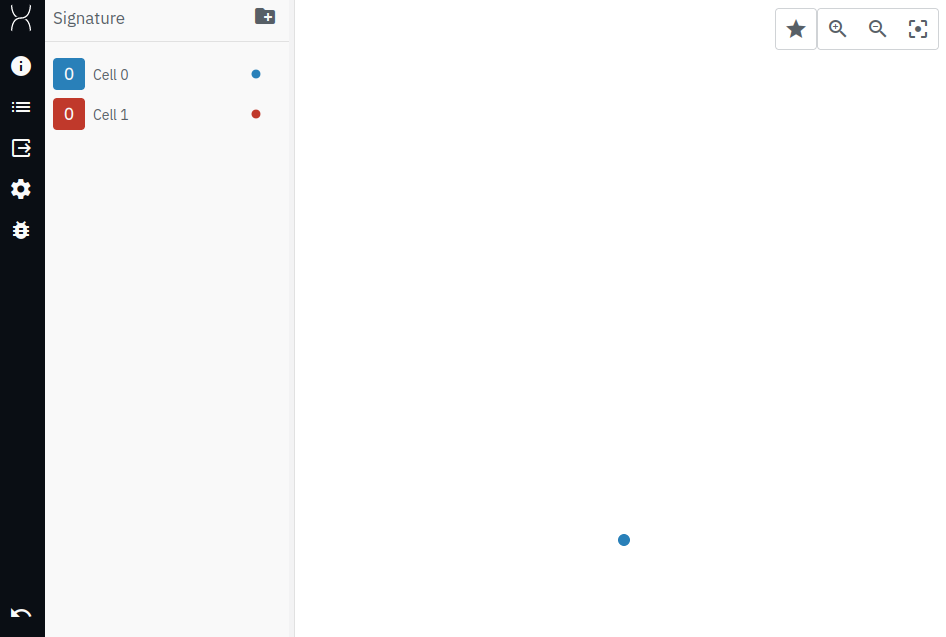

The workspace can be then cleared by clicking `Clear` (bottom-left, keyboard shortcut C).
Clicking on the left of the generator name, we can edit the generator name to respectively $C$ and $D$. $\LaTeX$ is supported with the usual dollar-sign convention.

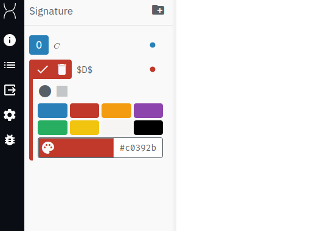

## The 1-cells

Now, to create the generating 1-cells, we need to tell the proof assistant their sources and targets. Let us start with $F$, which runs from $C$ to $D$.

First, we select $C$ by clicking on it or pressing the number 1. We can designate it as the source of some future $F$ by clicking `Source` (bottom-left, or clicking S).

Now the blue dot representing $C$ should appears in the bottom-left corner. The proof assistant has stashed the diagram we have chosen for source, and is waiting for us to select, or construct, the target.
In our case, this is easy, as the target of $F$ is just $D$. So let's click on $D$ and press `Target` (or T).
This will give a 1-cell, our $F$. We repeat the process with $C$ and $D$ swapped to construct $G$, which runs from $D$ to $C$.

Clicking on our newly constructed $F$, the resulting diagram will be displayed in the workspace. Note that since $F$ is a 1-cell, the diagram displayed will be 1-dimensional, which we read bottom-to-top.

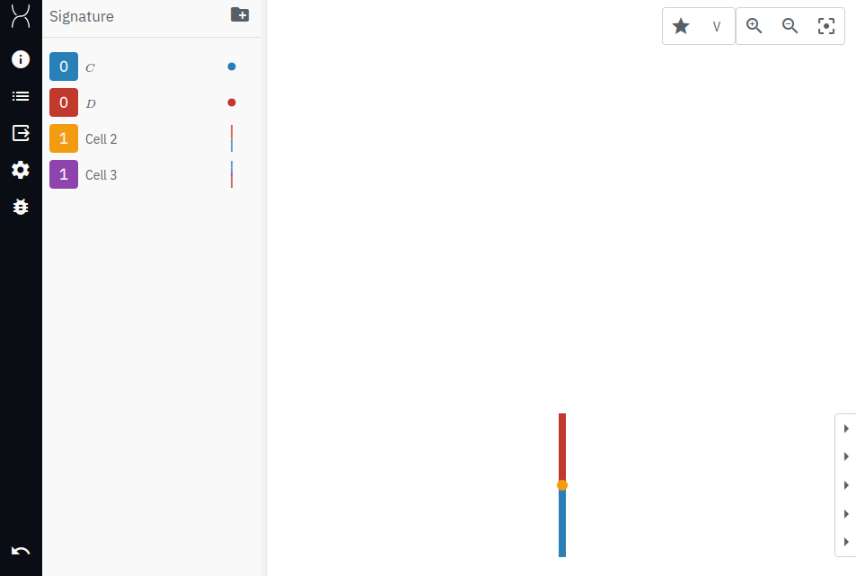

In this workspace view, we also have some slice-controls on the right, which we'll explain how to use later on. First, let us rename these 1-cells to $F$ and $G$, as we have done previously for $C$ and $D$.

## The 2-cells

Adding the 2-cells $\alpha$ and $\beta$ will be trickier for two reasons:
- Their sources and targets are not generating 1-cells, but composites of 1-cells.
- They have to be invertible.

Recall that $\alpha$ has source the identity on $1_C$ and target the composite of $F$ and $G$. Visually, it looks like a cup.
To construct the source, select the generator $C$ and click on `Identity` (or I): the blue point gets promoted to a blue line that we may take as the `Source` of our 2-dimensional $\alpha$.

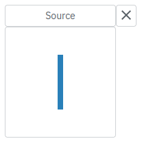

For the target, we select $F$ and then paste $G$ on top of it by clicking towards the upper edge. Since there is only one generator that $D$ as a source, namely $G$, it is automatically selected by the tool.

Now, this composite diagram we just constructed has the same boundary as the identity on $C$, which we selected as a source (they both have source and target $C$). This is a necessary condition for the tool to allow us construct a new generator in the signature called *globularity*.

For example, if we didn't compose $G$ on top of $F$, the globularity check would have failed (as the target of $F$ is $D$ and not $C$) and `Target` button would have been hidden by the tool.

Since in our case, the globularity check passes, we may construct $\alpha$ by taking our $G \circ F$ diagram as a target. This gets us the following cup diagram:

Now try to construct the dual diagram corresponding to $\beta$, the cap:

To make both 2-cells invertible, we can just click on the `Directed/Invertible` toggle, which appears when trying to edit a generator name. When a generator is flagged as `Invertible`, an (I) symbol will appear next to its name. In our case, this should only happen for $\alpha$ and $\beta$.

At this point, the signature should look like this:

We're done with our setup: the proof assistant has validated the 'let $C$ and $D$ be equivalent categories' part of our theorem, and now we will turn to proving the rest of the statement.

## Constructing the Adjoint

Our theorem states that we may construct new 2-cells in this signature which satisfy the triangular equations, also called the snake equations, for an adjuction between $F$ and $G$.
In particular, we may do so without changing one of the natural transformations.

Let's choose to keep $\alpha$ unvaried and to construct some other $\beta'$ such that $\alpha$ and $\beta'$ satisfy the snake equations. We claim that we may take $\beta'$ to be the composite $\beta \circ \alpha^{-1} \circ \beta^{-1}$.

Now, although we could prove the theorem by inserting this $\beta'$ at all the right places in the proof, keeping track of this data is somewhat non-trivial. For good ergonomics, it is much more convenient to save this definition of $\beta'$ as its own element of the signature.

Since we want something that will eventually replace $\beta$, it should at least have the same boundary as $\beta$. So let's select $\beta$ from the signature, to mark it as the current generator.

We now paste the inverse of $\alpha$ into the blue area by just clicking on bottom of the diagram. The tool alerts us that both $\alpha^{-1}$ and $\beta^{-1}$ may be pasted there, but $\beta^{-1}$ gives visibly the wrong result.

The workspace should now look like this:

We now need to 'close-off' the right-most blue region to make the boundary of $\beta$ by inserting a $\beta^{-1}$, so click again on the bottom edge of the diagram, and select $\beta^{-1}$. This should result in the sock diagram:

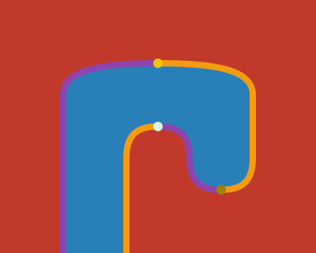

Note that if at any point you selected the wrong attachment option, you may undo that by pressing U.

We have now constructed our candidate for $\beta'$! To save the diagram as a new definition, click on `Theorem` (bottom-left or keyboard shortcut H). This will add two generators to our signature:
- A cell called 'Theorem', which contains the newly-defined $\beta'$,
- A cell called 'Proof', which contains the path taking the generator $\beta'$ to the diagram we previously constructed.

Hence the 'Proof' cell is really our witness that to what the definition of $\beta'$ is. Notice that is a 3-dimensional object, as indicated by the number on the left of its name. This is expected, as it should be a path between 2-dimensional things.

Let us rename the 'Theorem' generator to $\beta'$, and the 'Proof' generator to '$\beta'$ Definition' for clarity. The signature should now look like this:

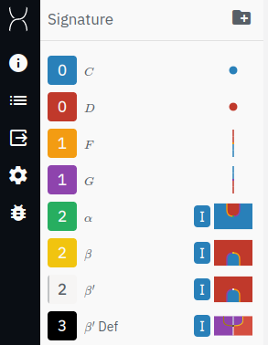

Notice in particular that $\beta'$ looks exactly like $\beta$, and that it also invertible, as we would expect. We did not have to flag it as such, as they tool already checked that it was constructed by composing only invertible generator.

We are now ready to prove that $\alpha$ and $\beta'$ satisfy the snake equations. These are unfortunately not dual, so we will have to check both separately.

## Proving the Snake Equation holds on $G$

After all this setup work, we're finally at the point where we can actually prove something in the tool. We will start by proving that we can contract down one of the snakes to the identity on $G$.

In theory we could start from either side of the equation, i.e. contract down the snake to the identity or, viceversa, build up the snake from the identity. However, in practice it is much easier to start with the most complex side of the equation and contract it down.

So, let us start by constructing our snake. It will need to have the same boundary as the identity on $G$, which looks like this:

We don't have that many options for how to construct a diagram fitting these requirements. The blue regions will need to come from $\alpha$, so we can start by selecting it as the current generator:

We now need to make the left-most region red. Clicking towards the left-edge, the tool will automatically attach the only matching diagram, which in this case is the identity on $G$.

We're almost there! To finish the snake we need to insert some kind of cup, which will close off the blue region on the left. If we click to attach on the top edge, we can choose to insert $\beta$ or $\beta'$. But, remember, $\beta$ need not satisfy the snake equation! Since we claim we can prove it with $\beta'$, let's select that and see how far we can get with the proof.

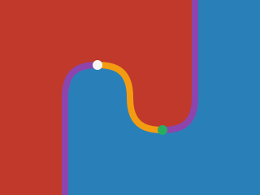

Note that is does have the same boundary as $G$.

Now, we want to construct an homotopy from this diagram into the identity on $G$. In order to do that, we need to be working one dimension higher. We can do this by taking the identity on the snake diagram in the current workspace, by clicking `Identity` or pressing I on the keyboard. Nothing should visibly change, as we are still seeing a 2d projection, but the view controls on the top-right corner should change to reflect the presence of this new dimension.

Although our view has not changed, whenever we do anything on the current diagram, the tool will compute its meaning as a 3d path. In other words, we can just try to simplify the current diagram into the identity on $G$, and the tool will do the book-keeping of what the overall proof looks like.

Having taken the identity on the snake, our first step of the proof will be to unravel the definition of $\beta'$. We can do that by clicking on the white dot that represents $\beta'$. If you are unsure of where that is, note that you can hover over the diagram to get a helpful tooltip.

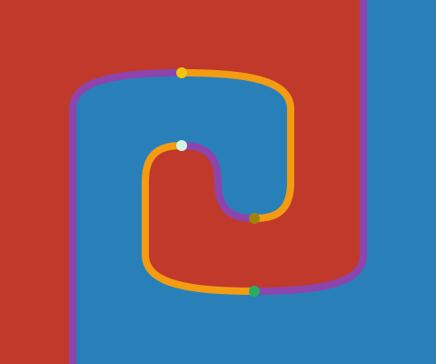

We now need to break up the right part of the sock, by inserting a copy of $\alpha$ and its inverse, also called a bubble. By carefully clicking on the region highlighted below, we can insert an inverse $\alpha$ bubble:

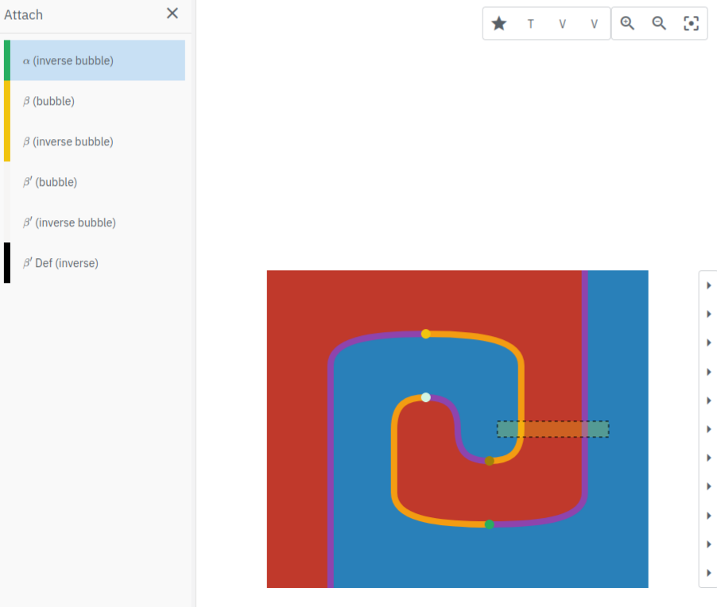

The resulting diagram is the broken sock:

We now drag down the left-most $\alpha^{-1}$ twice, so that the right copy of $\alpha$ moves on top of it. In category-theoretic terms, we all we are doing here is performing interchanges.

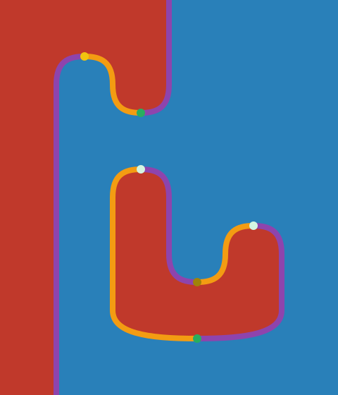

At this point, we have successfully transferred the inverse $\alpha$ bubble on the left, and we can merge the red surfaces by dragging either of the $\alpha$ or $\alpha^{-1}$ dots towards the other, while holding the SHIFT key. This tells the tool that we intend to kill-off something by composing it with its inverse.

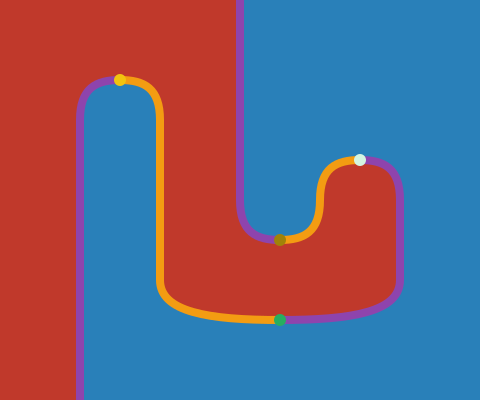

We're almost there: we're left with two pairs of $\beta,\beta^{-1}$ and $\alpha,\alpha^{-1}$ that we need to cancel. We start by dragging down the left-most $\beta$ node. We have to perform this move four times in order to get the following situation:

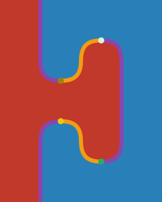

Now $\beta$ and $\beta'$ are vertically aligned, so we may cancel them by dragging either towards the other while holding SHIFT. This just leaves us with an $\alpha$ bubble:

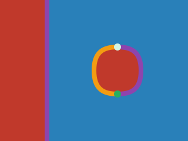

We squash the final bubble by dragging while holding SHIFT again, reaching our goal:

The great advantage of working in this diagrammatic way is that we can now ask the tool to render the entire proof we just did for us. To get into this view-from-the-top-dimension mode, we just have to click on the star symbol on the top-right corner. The diagram should look something like this:

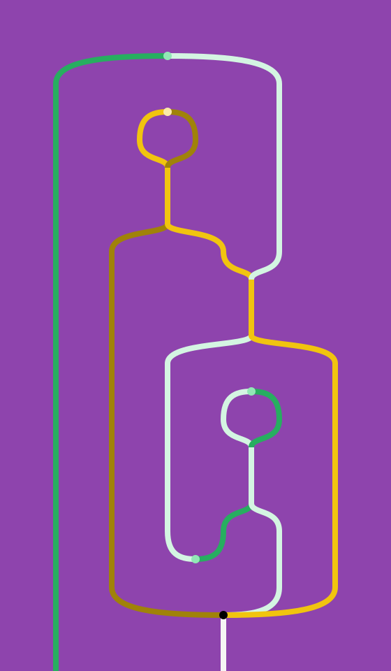

The fact that proofs are geometric objects in themselves allows us to reason visually about them. For example, it is evident from the above diagram that our earlier proof was not really optimal, as there are at least three regions in which not much is happening, which we could simplify again by performing contractions through dragging. As a challenge, try to reduce the proof down to this diagram:

Remember that we want to be careful not to over-contract our proofs: we still want to be able to tell what is going on, which is hard if the entire proof happens in a single step!

As we are done with this part of the proof, we can click `Theorem` or press H to add this result to our signature. For clarity, we can rename the 'Theorem' cell to 'Snake 1', and the 'Proof' cell to 'Proof of Snake 1'.

