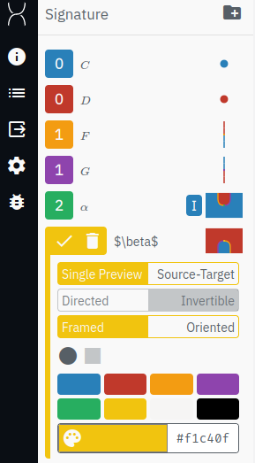

# How to use the tool: a Tutorial

In this tutorial, we will show show how to prove in [homotopy.io](https://beta.homotopy.io) that every equivalence of 1-categories may be promoted to an adjoint equivalence.

The content of this tutorial is contained in this [action dump](./homotopy-model/tests/examples/equivalence_to_adjoint_equivalence.json). You may download this file and import it into the tool through the `Debug` panel, the 5th icon on the top-left.
The button `Import actions` button allows to load the file and step through it by repeated `Undo`-ing (keyboard shortcut U) and `Redo`-ing (keyboard shortcut R).

You may use the `Undo` and `Redo` features at any point in the tutorial.

# Setup

The statement of the theorem requires the following generators in the signature:
- Two 0-cells $C,D$, the categories that are equivalent,
- Two 1-cells $F: C \to D,G: D \to C$, the back-forth functors,
- Two 2-cells $\alpha: 1_C \to G \circ F,\beta: F \circ G \to 1_D$, the invertible natural transformations that witness the equivalence.

So, let us start with the empty workspace viewed at [homotopy.io](https://beta.homotopy.io).
If we click on the `Signature` button (second on the left), we can see that it is currently empty, as expected. We will begin by constructing the signature we described above.

## The 0-cells

We start by adding two 0-cells. Click on the `Add` button (bottom-left, keyboard shortcut A). The two new generators should now show-up in the signature and can be selected by clicking on them or by using numbers 1-9 on the keyboard. At this point, the workspace should look like this:

The workspace can be then cleared by clicking `Clear` (bottom-left, keyboard shortcut C).
Clicking on the left of the generator name, we can edit the generator name to respectively $C$ and $D$. $\LaTeX$ is supported with the usual dollar-sign convention.

## The 1-cells

Now, to create the generating 1-cells, we need to tell the proof assistant their sources and targets. Let us start with $F$, which runs from $C$ to $D$.

First, we select $C$ by clicking on it or pressing the number 1. We can designate it as the source of some future $F$ by clicking `Source` (bottom-left, or clicking S).

Now the blue dot representing $C$ should appears in the bottom-left corner. The proof assistant has stashed the diagram we have chosen for source, and is waiting for us to select, or construct, the target.
In our case, this is easy, as the target of $F$ is just $D$. So let's click on $D$ and press `Target` (or T).
This will give a 1-cell, our $F$. We repeat the process with $C$ and $D$ swapped to construct $G$, which runs from $D$ to $C$.

Clicking on our newly constructed $F$, the resulting diagram will be displayed in the workspace. Note that since $F$ is a 1-cell, the diagram displayed will be 1-dimensional, which we read bottom-to-top.

In this workspace view, we also have some slice-controls on the right, which we'll explain how to use later on. First, let us rename these 1-cells to $F$ and $G$, as we have done previously for $C$ and $D$.

## The 2-cells

Adding the 2-cells $\alpha$ and $\beta$ will be trickier for two reasons:
- Their sources and targets are not generating 1-cells, but composites of 1-cells.
- They have to be invertible.

Recall that $\alpha$ has source the identity on $1_C$ and target the composite of $F$ and $G$. Visually, it looks like a cup.
To construct the source, select the generator $C$ and click on `Identity` (or I): the blue point gets promoted to a blue line that we may take as the `Source` of our 2-dimensional $\alpha$.

For the target, we select $F$ and then paste $G$ on top of it by clicking towards the upper edge. Since there is only one generator that $D$ as a source, namely $G$, it is automatically selected by the tool.

Now, this composite diagram we just constructed has the same boundary as the identity on $C$, which we selected as a source (they both have source and target $C$). This is a necessary condition for the tool to allow us construct a new generator in the signature called *globularity*.

For example, if we didn't compose $G$ on top of $F$, the globularity check would have failed (as the target of $F$ is $D$ and not $C$) and `Target` button would have been hidden by the tool.

Since in our case, the globularity check passes, we may construct $\alpha$ by taking our $G \circ F$ diagram as a target. This gets us the following cup diagram:

Now try to construct the dual diagram corresponding to $\beta$, the cap:

To make both 2-cells invertible, we can just click on the `Directed/Invertible` toggle, which appears when trying to edit a generator name. When a generator is flagged as `Invertible`, an (I) symbol will appear next to its name. In our case, this should only happen for $\alpha$ and $\beta$.

At this point, the signature should look like this:

We're done with our setup: the proof assistant has validated the 'let $C$ and $D$ be equivalent categories' part of our theorem, and now we will turn to proving the rest of the statement.

## Constructing the Adjoint

Our theorem states that we may construct new 2-cells in this signature which satisfy the triangular equations, also called the snake equations, for an adjuction between $F$ and $G$.
In particular, we may do so without changing one of the natural transformations.

Let's choose to keep $\alpha$ unvaried and to construct some other $\beta'$ such that $\alpha$ and $\beta'$ satisfy the snake equations. We claim that we may take $\beta'$ to be the composite $\beta \circ \alpha^{-1} \circ \beta^{-1}$.

Now, although we could prove the theorem by inserting this $\beta'$ at all the right places in the proof, keeping track of this data is somewhat non-trivial. For good ergonomics, it is much more convenient to save this definition of $\beta'$ as its own element of the signature.

Since we want something that will eventually replace $\beta$, it should at least have the same boundary as $\beta$. So let's select $\beta$ from the signature, to mark it as the current generator.

We now paste the inverse of $\alpha$ into the blue area by just clicking on bottom of the diagram. The tool alerts us that both $\alpha^{-1}$ and $\beta^{-1}$ may be pasted there, but $\beta^{-1}$ gives visibly the wrong result.

The workspace should now look like this:

We now need to 'close-off' the right-most blue region to make the boundary of $\beta$ by inserting a $\beta^{-1}$, so click again on the bottom edge of the diagram, and select $\beta^{-1}$. This should result in the sock diagram:

Note that if at any point you selected the wrong attachment option, you may undo that by pressing U.

We have now constructed our candidate for $\beta'$! To save the diagram as a new definition, click on `Theorem` (bottom-left or keyboard shortcut H). This will add two generators to our signature:
- A cell called 'Theorem', which contains the newly-defined $\beta'$,
- A cell called 'Proof', which contains the path taking the generator $\beta'$ to the diagram we previously constructed.

Hence the 'Proof' cell is really our witness that to what the definition of $\beta'$ is. Notice that is a 3-dimensional object, as indicated by the number on the left of its name. This is expected, as it should be a path between 2-dimensional things.

Let us rename the 'Theorem' generator to $\beta'$, and the 'Proof' generator to '$\beta'$ Definition' for clarity. The signature should now look like this:

Notice in particular that $\beta'$ looks exactly like $\beta$, and that it also invertible, as we would expect. We did not have to flag it as such, as they tool already checked that it was constructed by composing only invertible generator.

We are now ready to prove that $\alpha$ and $\beta'$ satisfy the snake equations. These are unfortunately not dual, so we will have to check both separately.

